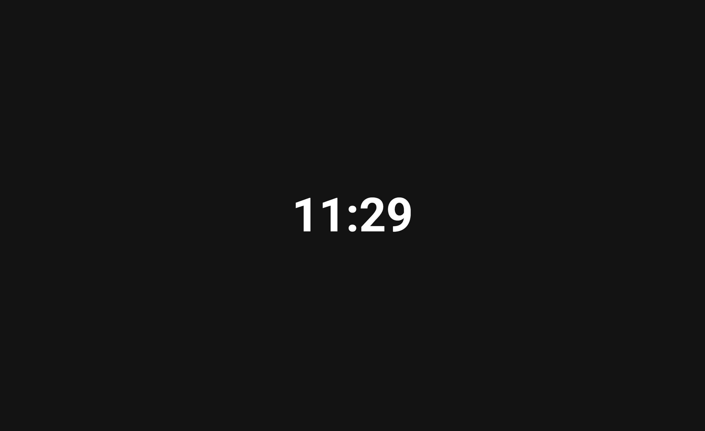

# Life Clock

Life Clock is a small reflective web app that turns a chosen lifespan into a
24-hour clock. Add a start date and either an end age or end date, then the app
shows where the current moment lands in that one-day view.



## What It Does

- Maps the time between your start and end dates onto a 24-hour clock.
- Opens with a friendly setup dialog on first visit.
- Stores your clock configuration in browser local storage.
- Supports system, light, and dark color modes.
- Serves localized routes for English, Russian, and Japanese.

## Tech Stack

- [Next.js 16](https://nextjs.org/) with the App Router and static export
- [React 19](https://react.dev/) and TypeScript
- [MUI 9](https://mui.com/) with Emotion
- [Dayjs](https://day.js.org/) for date calculations
- [React Hook Form](https://react-hook-form.com/) and [Zod](https://zod.dev/)
- [pnpm](https://pnpm.io/) for package management

## Development Setup

Use Node.js `24.16.0`, matching `.nvmrc`, and pnpm `11.4.0`, matching the
`packageManager` field in `package.json`.

```bash
nvm use
corepack enable
corepack prepare pnpm@11.4.0 --activate
pnpm install
```

Start the local development server:

```bash
pnpm dev
```

Open [http://localhost:3000](http://localhost:3000) to view the app.

## Useful Commands

```bash
pnpm dev
```

Runs the Next.js development server.

```bash
pnpm lint
```

Runs ESLint with the project configuration.

```bash
pnpm build
```

Builds the static production export into `out/`.

```bash
pnpm start
```

Serves the production build locally after `pnpm build`.

## Static Export

This project is configured for static hosting with `output: 'export'` in
`next.config.ts`. GitHub Pages deployment is handled by the workflow in
`.github/workflows/nextjs.yml`.
